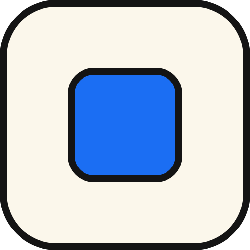
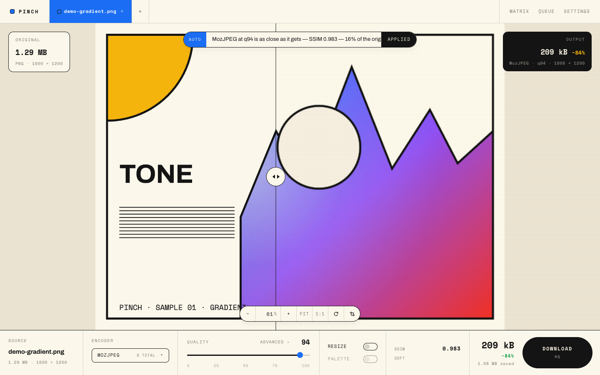

<p align="center">
  
</p>

<h1 align="center">Pinch</h1>

<p align="center">
  Client-side image compression: pick a codec, see what it costs, download the result — nothing is uploaded.
</p>

<p align="center">
  <a href="https://github.com/RamaHerbin/squish/actions/workflows/ci.yml"></a>
  <a href="./LICENSE"></a>
</p>

<p align="center">
  
</p>

<p align="center"><strong>Try it: https://pinch.rama.app</strong></p>

Pinch is a spiritual successor to [Squoosh](https://github.com/GoogleChromeLabs/squoosh),
which is no longer maintained. Same idea — codecs compiled to WebAssembly, running in
your browser — rebuilt on a current stack, with the batch, metrics and comparison
features Squoosh never got.

Every codec runs locally. There is no server, no upload, no account, no analytics, and
the app works with the network switched off once it has been loaded.

## Features

- **Reveal compare** — one canvas, a draggable divider wiping between the original and
  the encoded output, under a single shared pan/zoom, so both halves stay aligned even
  when one side has been resized.
- **Encoders** — AVIF, JPEG XL, WebP, MozJPEG, OxiPNG and QOI as WebAssembly builds via
  [jSquash](https://github.com/jamsinclair/jSquash), plus the browser's own canvas
  encoders for PNG, JPEG and WebP. Each wasm codec is imported on first use, so picking
  AVIF never downloads the JPEG XL build.
- **Decoders** — the browser first (WebCodecs `ImageDecoder`, then `createImageBitmap`,
  then an `` element), with a wasm fallback for AVIF, JPEG XL, WebP, JPEG, PNG and
  QOI. **HEIC/HEIF input** decodes through libheif. If the browser's decoder chokes on
  an exotic file, the wasm path is tried before giving up (and vice versa).
- **SVG input** — rasterised from the source markup, which is retained, so resizing an
  SVG re-renders the vector at the target size instead of upscaling pixels.
- **HDR-aware input** — PQ and HLG (read from the CICP transfer characteristic in
  AVIF/HEIC/HEIF) and gain-map HDR (Ultra HDR JPEG, Apple HEIC) are detected and
  labelled. Pixels are tone-mapped to SDR for encoding and the UI says so rather than
  pretending the pipeline is HDR.
- **SSIM metrics** — a real structural-similarity score for every encode, computed in a
  dedicated worker and reported with a plain-language verdict (`Excellent`, `Soft`,
  `Watch skies`…). Unmeasurable cases (resize on, so the grids differ) say
  `Unmeasured` instead of guessing.
- **Auto-suggest** — binary-searches the lowest quality that still reaches the SSIM
  target (0.99 by default) between q30 and q95, in at most six encodes.
- **Codec matrix** — MozJPEG, WebP, AVIF, JPEG XL and OxiPNG × four steps, 20 cells of
  size, savings, SSIM and verdict, with one recommended cell you can apply in a click.
  Rows are dealt to worker lanes so each lane keeps one codec warm.
- **Batch queue** — drop folders, encode with bounded parallelism (one worker per lane),
  export a ZIP that preserves the folder structure. Results are staged to OPFS, so a
  300-file run does not hold 300 blobs in the heap.
- **Multi-file tabs** — every open image gets its own tab and its own job engine.
  Switching tabs never re-decodes, and a background encode keeps running.
- **Light editing** — rotate by 90° steps and crop, applied before compression and
  shared by both sides of the compare.
- **Resize** — per side, either through the wasm resizer (lanczos3, mitchell, catrom,
  triangle, with premultiply and linear-RGB switches) or the browser's canvas kernels,
  stretching or containing to the target box.
- **Presets** — four built-ins plus your own, stored in IndexedDB, exportable as JSON,
  and shareable as a URL (`?p=…`: settings JSON, deflated, base64url-encoded, then
  strictly re-validated on the way in because a shared link is untrusted input).
- **PWA** — installable, offline-capable, an OS share target and a registered file
  handler, with an explicit "Reload" prompt when a new version is waiting.

## Pinch vs Squoosh

Honest version. Squoosh is the project Pinch learned from, and it still does things
Pinch does not.

| | Pinch | Squoosh |
| --- | --- | --- |
| Actively maintained | Yes | No — upstream stopped active development |
| Codecs (wasm) | AVIF, JPEG XL, WebP, MozJPEG, OxiPNG, QOI | AVIF, JPEG XL, WebP, WebP v2 (experimental), MozJPEG, OxiPNG, QOI |
| Batch / folder queue | Yes, with ZIP export | No — one image at a time |
| Quality metrics | SSIM per encode, in a worker, with verdicts | No |
| Auto-suggest quality | Yes — binary search to an SSIM target | No |
| Codec matrix sweep | Yes — 5 encoders × 4 steps in one table | No |
| HEIC/HEIF input | Yes (libheif) | No |
| HDR detection | Yes — PQ, HLG, gain map; labelled, tone-mapped to SDR | No |
| Multi-file tabs | Yes | No |
| Shareable presets | Yes — saved presets, JSON export, `?p=` links | No (settings live in the URL hash, not as named presets) |
| Compare surface | Reveal: original vs one encode under a shared pan/zoom | Two-up: two independently configured encodes side by side |
| Crop | Yes | No |
| Palette / colour quantization | **No** (see [limitations](#limitations)) | Yes — imagequant with dithering |
| Rotate implementation | Index permutation in the worker (no codec) | wasm `rotate` module |
| Translations | English only | Multiple languages |
| Track record | New, unproven | Years of production use, large community |

Pinch runs the same codec builds by way of [jSquash](https://github.com/jamsinclair/jSquash),
the community packaging of Squoosh's wasm codecs, and ports a handful of Squoosh
techniques (worker bridge, result cache, pinch-zoom maths, the magic-number sniffer).
See the [FAQ](./docs/FAQ.md#what-is-the-relationship-to-squoosh) for exactly what was
carried over.

## Quickstart

```sh
npm install
npm run dev        # dev server, with the COOP/COEP headers
npm run build      # production build + service worker
npm run preview    # serve the build, same headers
npm run check      # svelte-check against the strict tsconfig
npm test           # vitest (400+ unit tests, no browser required)
```

**COOP/COEP.** Threaded WebAssembly needs `SharedArrayBuffer`, which browsers only
expose in a cross-origin-isolated context. `vite.config.ts` installs a small plugin that
sets `Cross-Origin-Opener-Policy: same-origin` and
`Cross-Origin-Embedder-Policy: require-corp` on both the dev and preview servers; your
production host must send the same two headers. Without them the app still works —
`supportsWasmThreads()` reports `false` and jSquash picks its single-threaded builds —
it is just slower. Deploying your own instance: see [docs/deploy.md](./docs/deploy.md)
(Vercel, Netlify and Cloudflare Pages configurations).

## macOS app

Pinch also ships as a native macOS app: the same web build, running in a Tauri 2 window
instead of a browser tab, with a native save dialog and Finder file associations for
opening images directly. Build it yourself with `npm run tauri:build`, or grab a build
from the [Releases page](https://github.com/RamaHerbin/squish/releases) once one is
published there. See [docs/macos.md](./docs/macos.md) for the full walkthrough, including
what to do about the unsigned-app warning on first launch.

## Architecture

Five layers, each of which only depends on the ones above it:

- `src/lib/contracts/` — types and pure helpers, no imports outside the directory. The
  single source of truth for encoder ids, option shapes, MIME tables and job state.
- `src/lib/codecs/` — the codec worker, the Comlink bridge in front of it, the decode
  chain and runtime capability probes.
- `src/lib/state/` — the job engine: work diffing, the four-step pipeline, hierarchical
  aborts and a five-entry result cache.
- `src/lib/{metrics,matrix,batch,presets,edit,compare,options,settings}/` — features,
  each self-contained and each injected with what it needs rather than importing across.
- `src/App.svelte` — the composition root: router, tab strip, start-up handshake and
  the dependency injection that keeps state and codecs from importing each other.

Full write-up, with file paths: [docs/architecture.md](./docs/architecture.md).

## Browser support

Core editing works in any current Chromium, Firefox or Safari. Everything beyond that is
feature-detected at runtime and degrades rather than failing: no `crossOriginIsolated`
means single-threaded wasm; no native HEIC decoder means the libheif wasm path; no OPFS
means batch results stay in memory; no `launchQueue` means no "Open with Pinch".

Feature-by-feature matrix, and what was actually tested versus inferred:
[docs/browser-support.md](./docs/browser-support.md).

## Limitations

- **No HEIC or HDR *encoding*.** HEIC is HEVC in a box, which is patent-encumbered, and
  there is no maintained wasm HEVC encoder to ship. The pipeline is 8-bit sRGB
  throughout: HDR sources are detected, labelled and tone-mapped to SDR on the way in.
- **No palette quantization or dithering.** Squoosh's is libimagequant, which is
  GPL-3.0-or-later; Pinch is MIT and cannot link it without relicensing. The Palette
  switch in the toolbar is a disabled placeholder, marked as such.
- **EXIF is stripped.** Every encoder here re-encodes pixels and writes a fresh
  container, so camera, location and copyright tags do not survive. The "Keep EXIF
  metadata" setting persists your preference but has no effect on output yet; the
  settings screen says so.
- **SSIM, not butteraugli.** Single-scale SSIM on the luma plane — cheap enough to run
  on every slider commit and on 20 matrix cells. See the
  [FAQ](./docs/FAQ.md#why-ssim-and-not-butteraugli).
- **50 MB per file, 5000 files per drop.** Oversized files are named in the message that
  follows the drop; the file-count cap simply stops collecting.
- **English only.** No i18n layer.

## Contributing

Issues and pull requests are welcome. Before opening a PR, please run
`npm run check` and `npm test` — CI runs both. Architectural conventions worth reading
first: [docs/architecture.md](./docs/architecture.md).

See [CONTRIBUTING.md](./CONTRIBUTING.md) for the details, and
[CHANGELOG.md](./CHANGELOG.md) for release history.

## License

MIT © 2026 Rama Herbin. See [LICENSE](./LICENSE).

Codecs are third-party: the `@jsquash/*` builds are Apache-2.0, and HEIC decoding uses
`libheif-js` (LGPL-3.0), loaded as a separate dynamically-imported chunk.
